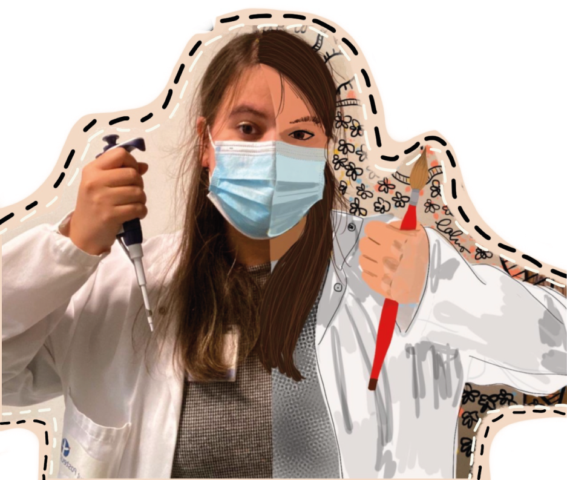

¡Hola! I am a microbiologist with a PhD in genetics interested in how Horizontal Gene Transfer drives the evolution of microbes, specially in the clinical set-up.

I am a postdoc in the lab of [Dr. Álvaro San Millán](https://www.pbelab.es/). My current research focuses on the understanding of sucessful plasmid-bacteria associations in nosocomimal infections to try to prevent the further dissemination of antimicrobial resistance in hospitals.

Past research topics have included the study of CRISPR-Cas systems and the development of synthetic biology tools to tackle the challenge of antimicrobial resistance.

I am a sleepy, caffeinated molecular biologist by day and a hyper scientific illustrator by night. You can learn more about my science outreach and scientific illustration work in this website.

To learn more about my scientific work, take at look at my [publications](./publications.html).

If you want to chat about science or education, or if you are interested in me doing some commission illustration work for you, do [get in touch](./contact.html)!

I've recently defended my Ph.D. at the [Institut Pasteur](https://research.pasteur.fr/en/), in the [Université de Paris](https://u-paris.fr/en/), in Paris, France, under the supervision of [Dr David Bikard](https://research.pasteur.fr/en/team/synthetic-biology/).
I previsouly graduated *summa cum laude* from the MSc Programme in [Microbiology](https://fenix.tecnico.ulisboa.pt/cursos/microbio/descricao)
from the Instituto Superior Técnico, Universidade de Lisboa.
I got my undergraduate degree in [Cell and Molecular Biology](https://www.fct.unl.pt/en/education/course/undergraduate-programme-cell-and-molecular-biology) graduating *summa cum laude* from the Nova School of Science and Technology, Nova University of Lisbon.

I am a firm believer in the power of knowledge and education. To continue my education, this time in the social sciences, I recently enrolled in a BSc. in Political Sciences from [UNED](https://uned.es/).

I currently live and work in Madrid, Spain.

I owe the code for this website to my awesome friend Gil Henriques! Check his github [here](https://github.com/GilHenriques/)

