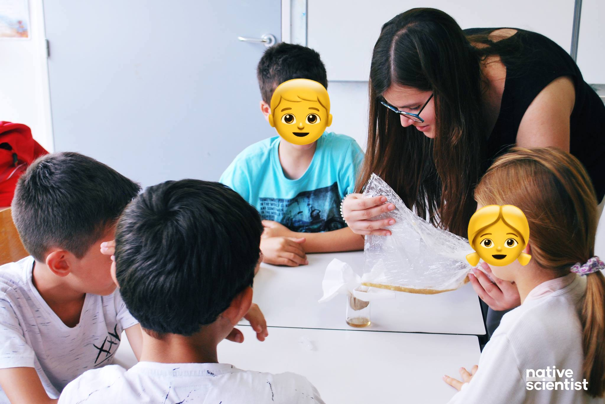
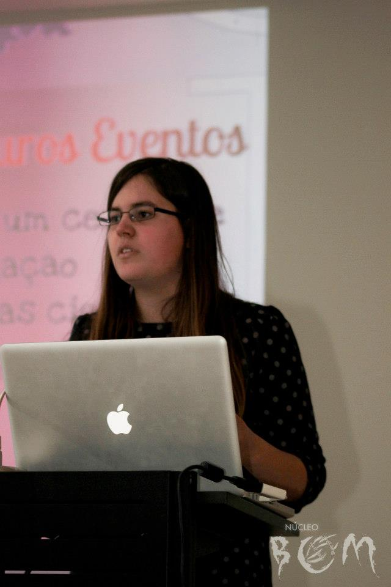

[Native Scientist](https://www.nativescientist.com/)

Native Scientist is a non-profit organisation that promotes science education, cultural diversity and cultural identity by organising science workshops for immigrant kids in their mother tongue. 

I have worked with this beautiful organisation since 2017, first as a scientist organising workshops for Portuguese kids in Paris, and now as the Creative Editor of the organisation.

My current work involves creating visual support for the workshops and doing illustrations for different science outreach efforts by the organisation.

[Viral, Palais de la Découverte, Paris](https://www.palais-decouverte.fr/fr/accueil/)

I participated in the ["Viral" ](https://www.palais-decouverte.fr/fr/ressources/expositions-passees/viral/) exposition in Palais de la Découverte, in Paris, co-organised by [Ciência Viva](https://www.cienciaviva.pt/).

I worked as a Portuguese guide in the exposition, explaining to visitors concepts such as infection, contagion or pathogenicity.

[iGEM](https://igem.org/Main_Page)

iGEM is an international Synthetic Biology competition, organised by MIT, in Boston, USA. The competition has a strong focus on science communication and citizen science.

I was a member of the [iGEM Paris Bettencourt 2016 team](http://2016.igem.org/Team:Paris_Bettencourt), working on the molecular biology aspects of the project, but also leading the social study of trying to understand the impact that our research could have in the Parisien community.

[NBCM](https://ae.fct.unl.pt/nbcm/)

During my BSc. degree in Cell and Molecular Biology, I was a founding member, and in its second year president, of the Cell and Molecular Biology student group. The NBCM has, since its creation, done an amazing work in bringing biology to the general public, organising workshops and  talks for all publics. 

